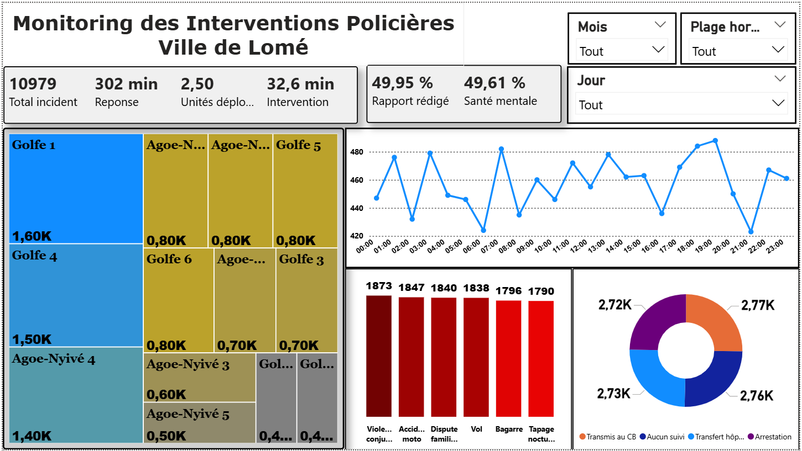
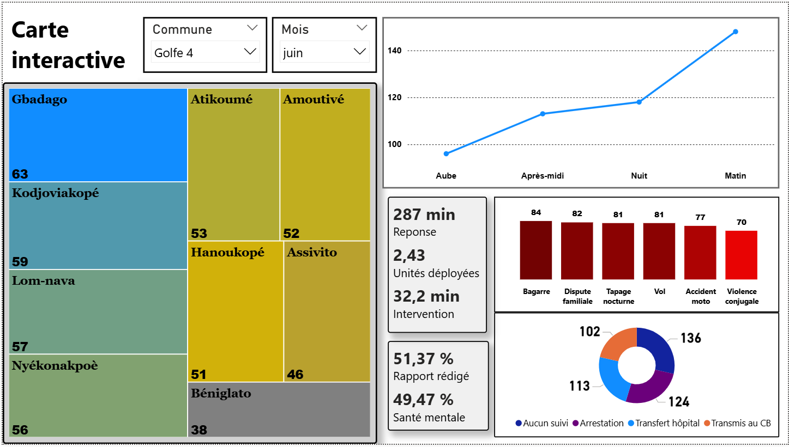
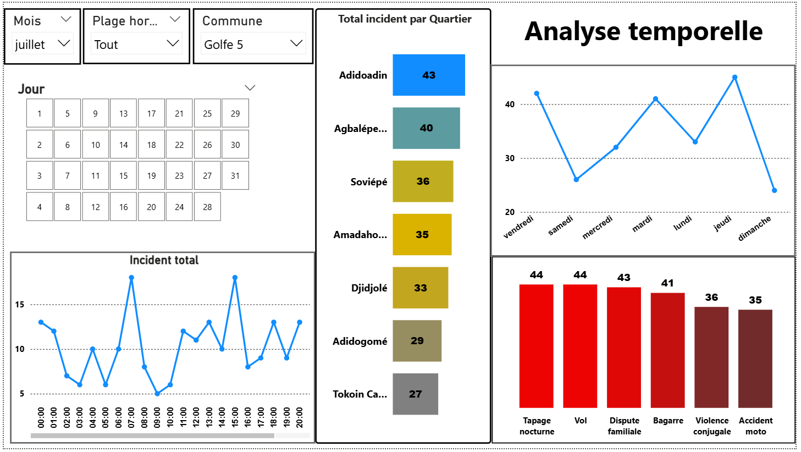
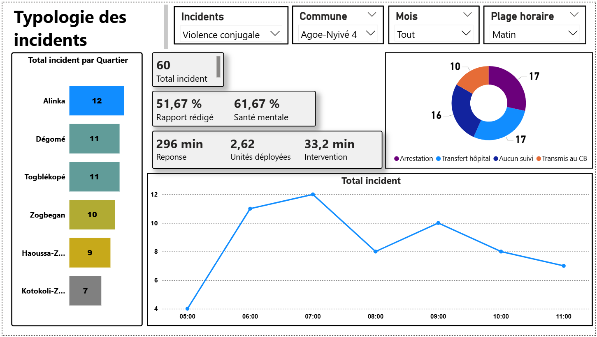

# Monitoring des Interventions Policières – Ville de Lomé  

## Contexte  
Le service de sécurité du District du Grand Lomé, sous l’impulsion du Commissaire Central, souhaite analyser les interventions de police afin de :  
- Identifier les **zones les plus sensibles**  
- Repérer les **types de problèmes récurrents**  
- Comprendre les facteurs liés à la **lenteur de réponse** des équipes  

Dans ce cadre, le challenge propose de se mettre dans la peau d’un **officier de police-analyste de données** et de concevoir un **tableau de bord Power BI** destiné au Commissaire Central.  

---

## Objectifs du projet  
- Suivre en temps réel les incidents et interventions  
- Analyser les délais moyens de réponse  
- Identifier les zones critiques à forte densité d’incidents   
- Formuler des **recommandations opérationnelles** basées sur les données  

---

## Étapes du travail  
- **Nettoyage des données**
- **Préparation & transformation**
- **Création de colonnes et Mesures calculées**
- **Analyse exploratoire** 
- **Outils & Technologies** : **Power BI** (Data cleaning, visualisation et construction du dashboard)

---

## Structure du Dashboard  

### 1. Vue Synthétique  
- Nombre total d’incidents  
- Temps moyen de réponse  
- Nombre moyen d’unités déployées  
- Pourcentage des cas liés à la santé mentale  
- Taux de rapports rédigés 
- Visualisation d’incidents par commune

### 2. Carte Interactive  
- Localisation des incidents par quartier  
- Visualisation par volume et type d’incidents
- Visualisation par conclusion de l'intervention
- Visualisation par plage horaire

### 3. Analyse Temporelle  
- Volume d’appels par heure  
- Volume d’appels par jour de la semaine  
- Segmentation aube / matin / après-midi / nuit 
- Visualisation du type d’incidents par jour

### 4. Typologie des Incidents  
- visualisation des incidents par quartier  
- Analyse par tranche horaire
- Visualisation de la conclusion de l'intervention par type d'incidents

### 5. Recommandations  
- **Réduire les délais de réponse** : optimisation des ressources et meilleure répartition géographique des unités.  
- **Renforcer la prévention ciblée** sur les incidents récurrents (violence conjugale, accidents moto).  
- **Exploiter l’analyse horaire** pour renforcer les patrouilles aux heures critiques.
- **Améliorer la coordination avec les hôpitaux** pour fluidifier les transferts.  
- **Mettre en place un système de suivi** des cas sans suite pour limiter les pertes d’information. 

---

## Dossier du projet

 [📥 Télécharger le rapport](GrandLome.pbix)

- `assets/` : Screenshot du rapport

---

## Auteur

TOZO Koffi Géraud

📬 Retrouvez-moi sur [LinkedIn](www.linkedin.com/in/koffi-géraud-tozo-bb2b2829a)

---

## Date

Aout 2025