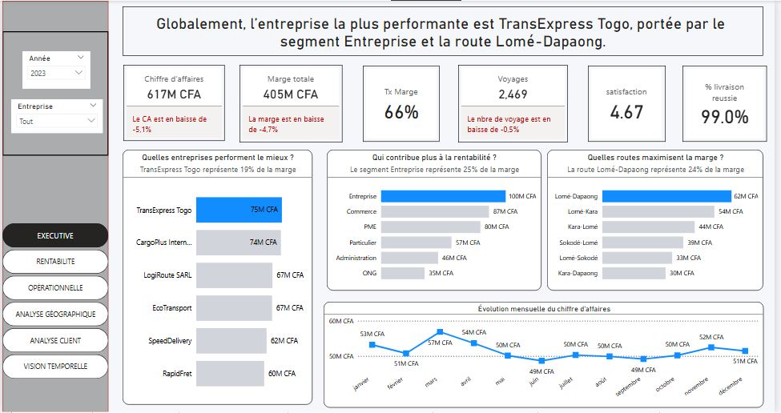
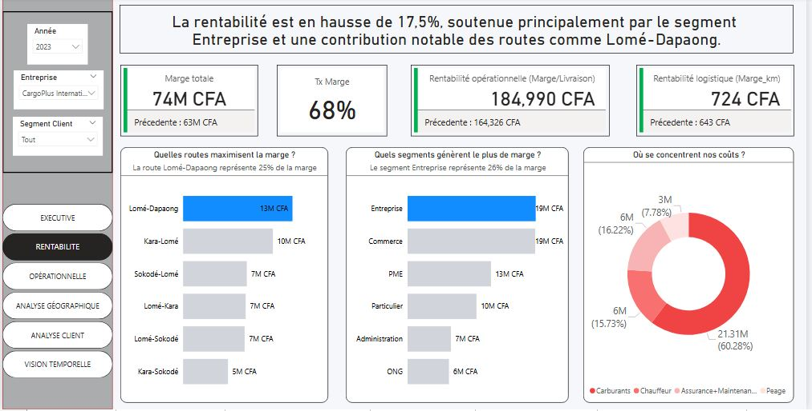
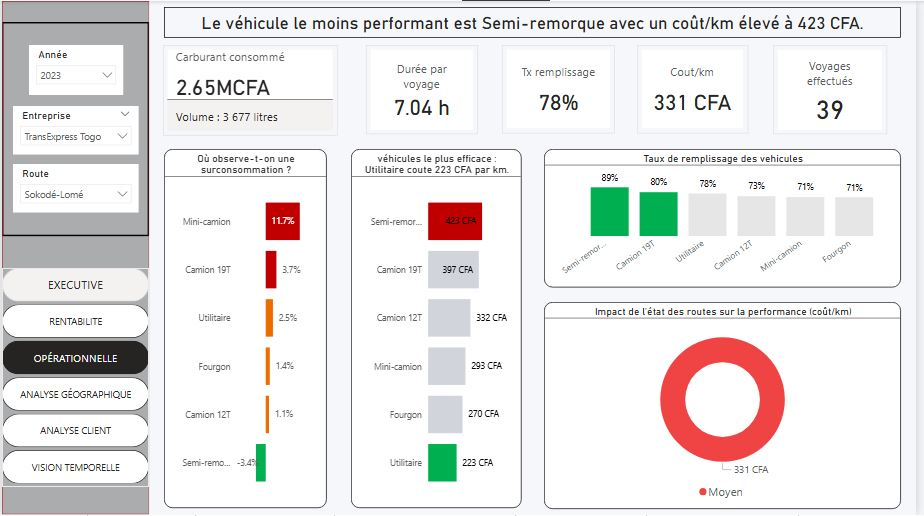
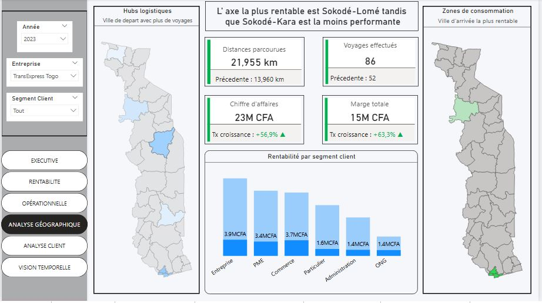
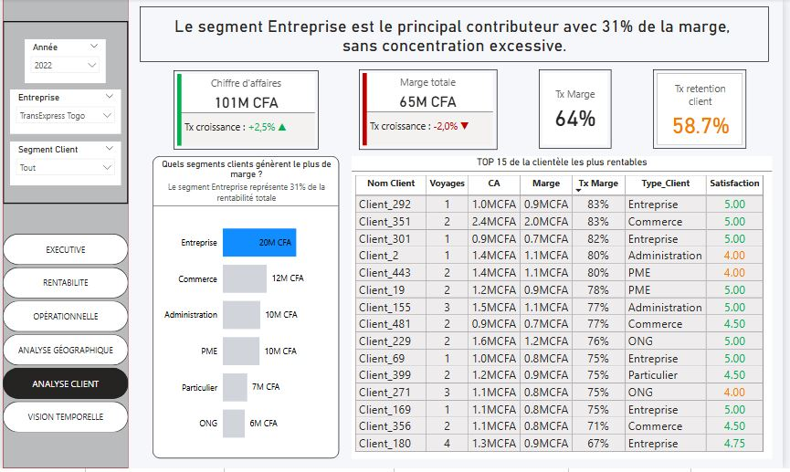
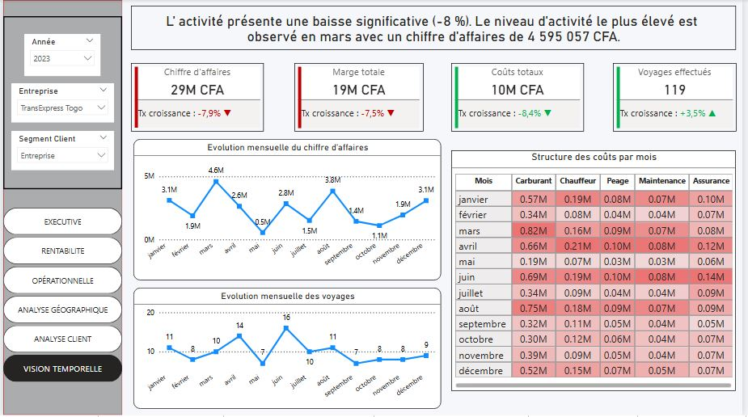

# 🚛 TRANSPORT & LOGISTIQUE : Analyse de la performance du transport au Togo

## Contexte 

Le secteur du transport et de la logistique au Togo connaît une croissance 
importante avec l'expansion du commerce régional et international. Plusieurs 
entreprises de transport opèrent sur le territoire national, offrant des 
services de livraison de marchandises entre les principales villes du pays.

Ce projet vous place dans la peau d'un consultant en business intelligence 
chargé d'analyser les performances du secteur sur la période 2020-2023.

---

## 🎯 Objectif du projet
Ce projet vise à analyser la performance globale du secteur du transport au Togo à travers un dashboard interactif permettant de piloter :

- la **rentabilité**
- l’**efficacité opérationnelle**
- la **performance géographique**
- la **valeur client**
- la **dynamique temporelle de l’activité**

L’approche adoptée repose sur un **storytelling analytique**, permettant de passer d’une vue globale du marché à une analyse détaillée par entreprise.

---

## 📊 1. Vue Executive – Lecture stratégique du marché

### 🔍 Insight clé
Le marché du transport présente une **légère contraction en 2023**, avec :
- un **chiffre d’affaires en baisse (-5,1%)**
- une **marge en recul (-4,7%)**
- une activité globalement stable (voyages -0,5%)

👉 Malgré ce contexte, **TransExpress Togo émerge comme leader**, représentant **19% de la marge totale du marché**.

### 🧠 Lecture métier
La rentabilité du secteur repose fortement sur :
  - le segment **Entreprise (25% de la marge)**
  - des axes stratégiques comme **Lomé – Dapaong (24%)**

👉 Cela révèle une **forte concentration de la valeur**, à la fois :
- sur certains **clients**
- et sur certaines **routes**

👉 **Enjeu stratégique :** sécuriser ces segments tout en réduisant la dépendance.

---

## 💰 2. Analyse de la rentabilité – Moteurs de création de valeur

### 🔍 Insight clé
Contrairement à la tendance marché, **TransExpress Togo améliore sa performance** (**+15,5% de rentabilité**) malgré une baisse de la **marge par livraison** et une diminution de la **rentabilité logistique (CFA/km)**

### 🧠 Lecture métier
La croissance est tirée par :
  - le segment **Entreprise (~25% de la marge)**
  - des routes structurantes comme **Sokodé - Lomé**

Cependant, un point critique apparaît :
  - **~60% des coûts sont liés au carburant**

👉 **Enjeu opérationnel majeur :**
> La performance est bonne, mais **fortement exposée au coût énergétique**.

👉 **Levier d’action :**
- optimisation des trajets
- amélioration de la consommation
- arbitrage flotte

---

## ⚙️ 3. Analyse opérationnelle – Efficacité des ressources

### 🔍 Insight clé
- Coût moyen : **331 CFA/km**
- Taux de remplissage : **78%**
- Durée moyenne : **7,04h par trajet**

### 🧠 Lecture métier
- Forte hétérogénéité de performance selon les véhicules :
  - **Utilitaire = plus efficace (223 CFA/km)**
  - **Semi-remorque = moins performant (423 CFA/km)**

- Anomalies opérationnelles :
  - surconsommation sur certains véhicules (**Mini-camion +11,7%**)
  - sous-performance malgré bon remplissage (Semi-remorque)

👉 **Enjeu opérationnel :**
> Mauvaise allocation des ressources = perte de marge.

👉 **Recommandation :**
- prioriser les véhicules les plus efficients
- revoir l’usage des semi-remorques
- surveiller les écarts de consommation

---

## 🌍 4. Analyse géographique – Performance des axes logistiques

### 🔍 Insight clé
- Forte croissance :
  - **CA +14,6%**
  - **Marge +15,5%**
- **Sokodé – Lomé = axe le plus rentable**

### 🧠 Lecture métier
- L’activité est tirée par certains corridors logistiques clés
- Mais des axes restent sous-performants (ex : Lomé – Tsévié)

👉 **Enjeu stratégique :**
> Arbitrer entre expansion et optimisation du réseau.

👉 **Axes d’amélioration :**
- renforcer les routes rentables
- optimiser ou abandonner les axes déficitaires

---

## 👥 5. Analyse client – Structure et qualité de la demande

### 🔍 Insight clé
- **Taux de rétention faible (~58,7%)**
- Le segment **Entreprise domine (31% de la marge)**

### 🧠 Lecture métier
- Bonne rentabilité mais :
  - **fidélisation insuffisante**
  - risque de volatilité du chiffre d’affaires

- Le portefeuille client est :
  - rentable
  - relativement diversifié (pas de dépendance extrême)

👉 **Enjeu critique :**
> La croissance future dépendra de la **capacité à retenir les clients**.

👉 **Recommandations :**
- renforcer la relation client (B2B)
- suivre la satisfaction (déjà élevée)
- mettre en place des stratégies de fidélisation

---

## 📈 6. Vision temporelle – Dynamique de l’activité

### 🔍 Insight clé
- Baisse de l’activité :
  - **CA -7,9%**
  - **Marge -7,5%**
- Pic d’activité en **mars**

### 🧠 Lecture métier
- Activité **irrégulière et saisonnière**
- Forte variabilité mensuelle des coûts (notamment carburant)

👉 **Enjeu stratégique :**
> Mieux anticiper la demande et lisser l’activité.

👉 **Leviers :**
- planification des ressources
- ajustement de la capacité
- optimisation des périodes creuses

---

## 🧩 Conclusion générale

Ce dashboard met en évidence un modèle économique caractérisé par :

### ✅ Forces
- leadership clair sur le marché
- bonne rentabilité opérationnelle
- axes logistiques performants
- portefeuille client rentable

### ⚠️ Risques
- forte dépendance au carburant
- faible rétention client
- inefficience de certains véhicules
- concentration de la valeur

### 🚀 Opportunités
- optimisation des coûts logistiques
- amélioration de la fidélisation
- meilleure allocation des ressources
- arbitrage stratégique des routes

---

## 🛠️ Outils utilisés
- **Power BI** (data visualization & storytelling)
- **DAX** (mesures analytiques avancées)
- **Modélisation des données** (schéma en étoile)

---

## 💡 Valeur ajoutée du projet
Ce projet ne se limite pas à une visualisation de données, mais propose :
- une **lecture métier structurée**
- des **insights actionnables**
- un **outil d’aide à la décision stratégique**

---

## Dossier du projet

 [📥 Télécharger le rapport](Transport.pbix)

---

## Auteur

TOZO Koffi Géraud

📬 Retrouvez-moi sur [LinkedIn](www.linkedin.com/in/koffi-géraud-tozo-bb2b2829a)

---

## Date

Mars 2026